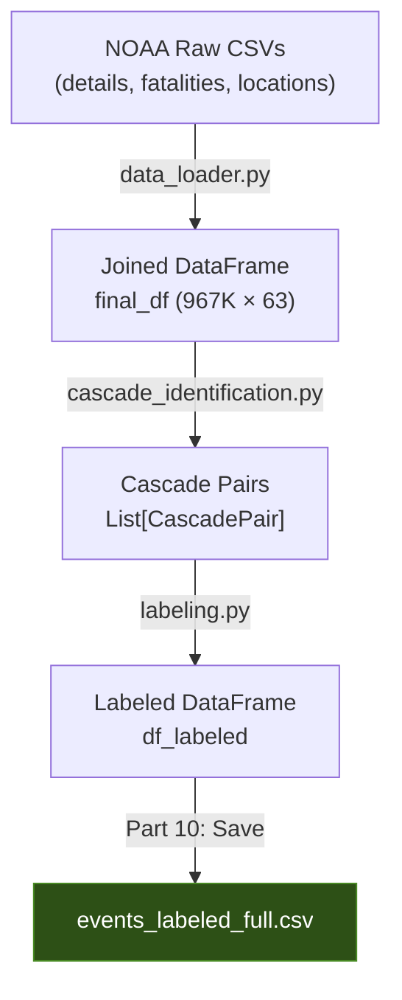

# `events_labeled_full.csv` — Dataset Documentation

> **Source data**: NOAA Storm Events Database (details, fatalities, locations tables)
> **Location**: `data/processed/events_labeled_full.csv`

---

## Overview

This dataset is the primary modeling-ready output of the cascade EDA notebook. Each row represents a single NOAA storm event (2011–2025), enriched with cascade labels that capture whether the event triggered secondary events and what types those secondary events were.

**Problem statement**: *Given event X, predict what types of secondary events occur (multilabel classification).*

**Scale**: ~967,000 events × ~50 columns

---

## Target Columns

These are the prediction targets and cascade metadata produced by `src/labeling.py`.

| Column | Type | Description |
|--------|------|-------------|
| `target` | `list[str]` | **Primary multilabel target.** A list of secondary event types this event triggered. An empty list `[]` means the event did not cause any cascading secondary events. Example: `["Flash Flood", "Tornado"]` means this event caused both a flash flood and a tornado. |
| `is_cascade_result` | `bool` | `True` if this event was itself triggered by another event (i.e., it appears as a secondary event in at least one cascade pair). Useful for filtering — in many modeling setups you may want to predict only from primary/trigger events. |
| `is_cascade` | `bool` | `True` if the event is involved in **any** cascade relationship — either as a trigger (`target` is non-empty) or as a result (`is_cascade_result` is True). Convenience flag computed as `has_valid_target OR is_cascade_result`. |

### Target Details

- **Task type**: Multilabel classification
- **Label space**: The set of all NOAA event types that appear as secondary events in identified cascades (variable, typically 25–35 unique types)
- **Class imbalance**: Most events (~95%) have an empty target list — cascades are relatively rare
- **Label cardinality**: Events that do cascade typically trigger 1–3 secondary event types

### How targets are generated

1. **Cascade identification**: Pairs of (primary, secondary) events are identified based on:
   - **Temporal proximity**: Secondary event starts within 7 days of primary event ending
   - **Spatial proximity**: Same county (CZ_FIPS match) by default
   - **Episode grouping**: Both events share the same NOAA `EPISODE_ID`
   - **Domain-validated causal patterns**: Only pairs with documented causal mechanisms are retained (see [cascade_definition.py])

2. **Label creation** [labeling.py]: For each event, all secondary event *types* it triggers are collected into a sorted list, forming the multilabel target.

---

## Feature Columns

### Identifiers

| Column | Type | Description |
|--------|------|-------------|
| `EVENT_ID` | `int` | Unique identifier for each event (NOAA-assigned) |
| `EPISODE_ID` | `int` | Groups related events into a weather episode (e.g., a single hurricane system). Critical for cascade identification — events in the same episode are more likely causally linked. |
| `EVENT_TYPE` | `str` | The NOAA event type (e.g., `"Hurricane (Typhoon)"`, `"Flash Flood"`, `"Tornado"`). There are 48 official event types per NWS Instruction 10-1605. This is the **input label** for the primary event. |

---

### Temporal Features

| Column | Type | Description |
|--------|------|-------------|
| `YEAR` | `int` | Year of event occurrence (2011–2025) |
| `MONTH_NAME` | `str` | Month name (e.g., `"January"`) |
| `BEGIN_YEARMONTH` | `int` | Year-month of event start as integer (e.g., `202301`). Useful for time-series aggregation and seasonal trend analysis. |
| `END_YEARMONTH` | `int` | Year-month of event end |
| `BEGIN_DAY` | `int` | Day-of-month of event start (1–31) |
| `END_DAY` | `int` | Day-of-month of event end |
| `BEGIN_DATETIME` | `datetime` | Parsed event start timestamp. Combined from `BEGIN_DATE_TIME` string. Primary temporal feature for cascade sequencing. |
| `END_DATETIME` | `datetime` | Parsed event end timestamp. The gap between one event's `END_DATETIME` and another's `BEGIN_DATETIME` determines cascade temporal eligibility. |
| `CZ_TIMEZONE` | `str` | Timezone of the county/zone (e.g., `"EST-5"`, `"CST-6"`). Important for correct temporal ordering across timezone boundaries. |

---

### Location / Spatial Features

| Column | Type | Description |
|--------|------|-------------|
| `STATE` | `str` | US state name, uppercase (e.g., `"TEXAS"`, `"NEW YORK"`) |
| `STATE_FIPS` | `int` | Numeric FIPS code for the state (e.g., `48` for Texas) |
| `CZ_NAME` | `str` | County/Zone name (e.g., `"HARRIS"`, `"ATLANTIC COASTAL"`) |
| `CZ_FIPS` | `int` | County/Zone FIPS code. Combined with `STATE_FIPS`, this uniquely identifies the geographic unit. |
| `CZ_TYPE` | `str` | Type of geographic zone: `"C"` (County), `"Z"` (NWS Forecast Zone), or `"M"` (Marine). Determines the spatial resolution of the event record. |
| `LOCATION_KEY` | `str` | Pre-computed join key: `STATE_FIPS (2-digit) + "_" + CZ_FIPS (3-digit)`. Example: `"48_201"` for Harris County, TX. Useful for spatial grouping without recomputing. |
| `WFO` | `str` | Weather Forecast Office identifier (e.g., `"HGX"`). Captures regional observation and reporting patterns. |
| `BEGIN_LAT` | `float` | Latitude of event start point (decimal degrees). ~62% populated. |
| `BEGIN_LON` | `float` | Longitude of event start point (decimal degrees, negative for Western Hemisphere) |
| `END_LAT` | `float` | Latitude of event end point |
| `END_LON` | `float` | Longitude of event end point |
| `LATITUDE` | `float` | Latitude from the NOAA Locations table (secondary geospatial source, joined via `EVENT_ID`). ~55% populated. |
| `LONGITUDE` | `float` | Longitude from the NOAA Locations table |
| `BEGIN_LOCATION` | `str` | Named location of event start (e.g., `"HOUSTON"`) |
| `END_LOCATION` | `str` | Named location of event end |
| `BEGIN_RANGE` | `float` | Distance (miles) from event start to a named reference point |
| `END_RANGE` | `float` | Distance (miles) from event end to a named reference point |
| `BEGIN_AZIMUTH` | `str` | Compass direction from reference point to event start (e.g., `"NNW"`, `"E"`) |
| `END_AZIMUTH` | `str` | Compass direction from reference point to event end |

> [!NOTE]
> Two sets of coordinates exist: `BEGIN_LAT/BEGIN_LON` (from the details table) and `LATITUDE/LONGITUDE` (from the locations table). They may differ because the locations table can provide more precise or alternate observation points.

---

### Severity / Mechanism Features

| Column | Type | Description |
|--------|------|-------------|
| `MAGNITUDE` | `float` | Event magnitude measurement. Meaning depends on `MAGNITUDE_TYPE`: wind speed (kts/mph), hail diameter (inches), etc. ~53% populated. |
| `MAGNITUDE_TYPE` | `str` | Unit/type for `MAGNITUDE`: `"EG"` (estimated gust), `"MG"` (measured gust), `"ES"` (estimated sustained), `"MS"` (measured sustained). ~37% populated. |
| `CATEGORY` | `float` | Hurricane category (1–5, Saffir-Simpson scale). Only populated for hurricane events (~0.05% of all events). |
| `TOR_F_SCALE` | `str` | Enhanced Fujita scale rating for tornadoes (e.g., `"EF0"`, `"EF3"`). Only populated for tornado events (~2.2%). |
| `TOR_LENGTH` | `float` | Tornado path length in miles |
| `TOR_WIDTH` | `float` | Tornado path maximum width in yards |
| `FLOOD_CAUSE` | `str` | Cause of flooding (e.g., `"Heavy Rain"`, `"Ice Jam"`, `"Dam/Levee Break"`). Only populated for flood events (~10%). |

---

### Impact / Loss Features

| Column | Type | Description |
|--------|------|-------------|
| `INJURIES_DIRECT` | `int` | Injuries directly caused by the event |
| `INJURIES_INDIRECT` | `int` | Injuries indirectly caused (e.g., car accident due to icy roads) |
| `DEATHS_DIRECT` | `int` | Deaths directly caused by the event |
| `DEATHS_INDIRECT` | `int` | Deaths indirectly caused |
| `DAMAGE_PROPERTY` | `str` | Raw property damage string as reported (e.g., `"25K"`, `"1.5M"`, `"0"`). Retained for data-quality audit trail. |
| `DAMAGE_CROPS` | `str` | Raw crop damage string |
| `DAMAGE_PROPERTY_USD` | `float` | Parsed property damage in US dollars |
| `DAMAGE_CROPS_USD` | `float` | Parsed crop damage in US dollars |
| `TOTAL_DAMAGE_USD` | `float` | `DAMAGE_PROPERTY_USD + DAMAGE_CROPS_USD` |
| `FATALITY_COUNT` | `int` | Total fatality count for this event (aggregated from fatalities table) |
| `FATALITY_TYPES` | `str` | Comma-separated fatality type information (direct/indirect breakdown). Only populated for events with fatalities (~0.8%). |

---

### Narrative / Text Features

| Column | Type | Description |
|--------|------|-------------|
| `EVENT_NARRATIVE` | `str` | Free-text description of the specific event. Useful for NLP-based feature extraction and validation of cascade relationships. |
| `EPISODE_NARRATIVE` | `str` | Free-text description of the broader weather episode. Provides context about the meteorological situation that produced multiple events. |

---

### Data Quality / Provenance

| Column | Type | Description |
|--------|------|-------------|
| `SOURCE` | `str` | Source of the event report (e.g., `"Trained Spotter"`, `"Law Enforcement"`, `"Emergency Manager"`) |
| `DATA_SOURCE` | `str` | NOAA data source identifier (typically `"CSV"`) |

---

## Generation Pipeline



### Step-by-step

1. **Load**: `load_all_storm_data()` reads 15 years of NOAA CSV files (details, fatalities, locations)
2. **Join**: `join_storm_data()` merges the three tables on `EVENT_ID`, aggregating fatality counts and location coordinates
3. **Parse**: Datetime strings are parsed via `parse_noaa_datetime()`; damage strings via `parse_damage_value()`
4. **Identify cascades**: `identify_cascades()` finds primary→secondary event pairs using temporal, spatial, and domain-knowledge constraints
5. **Label**: `create_cascade_labels()` converts cascade pairs into per-event multilabel targets
6. **Save**: The final cell selects key columns + cascade columns and writes to CSV

---

## Configuration Used

The cascade identification uses the **conservative config** by default:

| Parameter | Value | Description |
|-----------|-------|-------------|
| `temporal_window_days` | 7 | Secondary must start within 7 days of primary ending |
| `spatial_proximity` | `SAME_COUNTY` | Both events must be in the same county (CZ_FIPS match) |
| `require_same_episode` | `True` | Both events must share the same NOAA episode ID |
| `require_different_event_types` | `True` | Primary and secondary must be different event types |
| `use_domain_patterns` | `True` | Only scientifically documented causal pairs are accepted |

> [!IMPORTANT]
> The `use_domain_patterns=True` filter means only cascade pairs with documented causal mechanisms (from peer-reviewed literature) are included. This significantly reduces false positives but may miss novel cascade patterns. See cascade_definition.md for the full list of 130+ validated causal pairs and their references.

---

## Usage Notes

- **Missing values**: Many columns have high null rates (e.g., `CATEGORY` is 99.9% null — only applies to hurricanes). This is expected and reflects the event-type-specific nature of the fields.
- **Target encoding for modeling**: Use `to_binary_matrix()` from `src/labeling.py` to convert the list-based `target` column into a binary indicator matrix suitable for sklearn multilabel classifiers.
- **Feature engineering**: Use `engineer_all_features()` from `src/features.py` to create derived features (duration, season, episode position, event-type flags, etc.) from the raw columns in this dataset.
- **Train/test split**: Consider temporal splits (e.g., train on 2011–2022, test on 2023–2025) rather than random splits to avoid temporal leakage.
- **The `target` column is stored as a string** representation of a Python list in the CSV. When loading, parse it with:
  ```python
  import ast
  df['target'] = df['target'].apply(ast.literal_eval)
  ```
